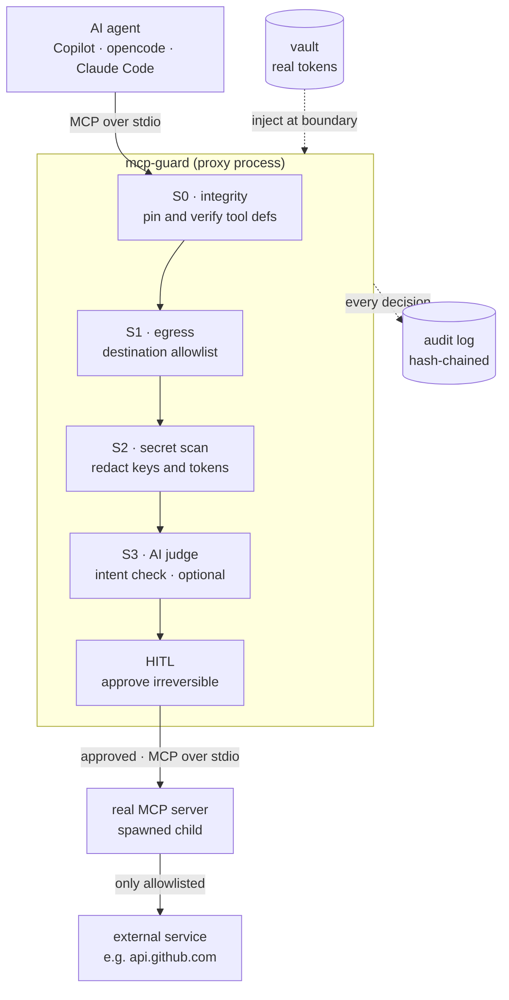

# Data-flow diagram for the README

Paste the fenced ```mermaid block below straight into your README. GitHub renders it automatically —
no images, no build step.

---

## Option 1 — Mermaid (renders as a diagram on GitHub)



How to read it: the AI agent talks to `mcp-guard` over stdio (no network port). mcp-guard runs every
tool call through the pipeline (S0 → S1 → S2 → S3 → HITL), logs each decision to a hash-chained audit
log, injects the real token from the vault only at the boundary, and forwards the *approved* call —
again over stdio — to the real MCP server it spawned as a child. That server may only reach
allowlisted destinations.

---

## Option 2 — Plain text (zero rendering, works literally everywhere)

```text
                          inject token at boundary
                     vault ──────────────┐
                                          ▼
 AI agent  ──MCP/stdio──►   mcp-guard (proxy process)   ──MCP/stdio──►  real MCP server
                           S0 → S1 → S2 → S3 → HITL          (spawned child)
                                    │                              │
                                    ▼                              ▼ only allowlisted
                          audit log (hash-chained)         external service
                                                           e.g. api.github.com
```
